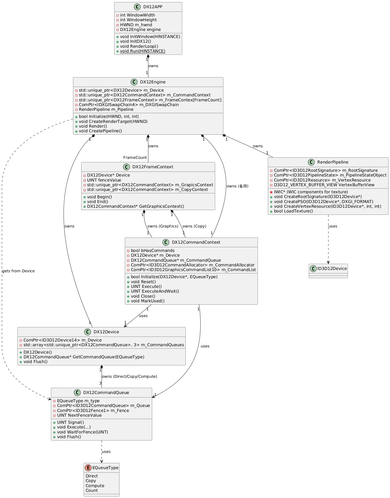

# DX12 Simple Rendering Engine

一个基于 **[dgaf 的 DX12 快速教程系列](https://blog.csdn.net/dgaf2198588973/category_12091102.html)** 构建的轻量级 DirectX 12 渲染引擎示例。

本项目对应教程中 **“画钻石原矿”**（第 4 篇）及之前的基础章节，实现了从窗口创建到纹理渲染的完整流程，代码结构清晰、模块化强，非常适合 DX12 初学者深入理解底层机制。

### 主要功能

- 支持 DirectX 12（Feature Level 11.0+）
- 三种命令队列（Direct / Copy / Compute）
- 每帧独立命令上下文（DX12FrameContext + DX12CommandContext）
- 使用 WIC 加载 PNG 纹理并上传到 GPU（当前使用 `diamond_ore.png`）
- 简单 Root Signature + Descriptor Table + Static Sampler
- 全屏纹理四边形渲染（两个三角形拼接）
- 正确的资源屏障与 CPU/GPU 同步（Fence + MsgWaitForMultipleObjects）

### 项目结构

```
DX12Engine/
├── Assets/
│   ├── Shaders/
│   │   └── texshader.hlsl
│   └── Textures/
│       └── diamond_ore.png
├── Core/                    # DX12 核心封装
│   ├── DX12Device.*
│   ├── DX12CommandQueue.*
│   ├── DX12CommandContext.*
│   ├── DX12FrameContext.*
│   └── DX12Queue.h
├── Engine/
│   ├── DX12Engine.*         # 引擎主类
│   └── RenderPipeline.*     # PSO、RootSignature、纹理加载
├── DX12APP.*                # Windows 窗口与消息循环
├── stdafx.h
└── README.md
```

### 项目架构图

### 系统要求

- Windows 10 / 11（64位）
- Visual Studio 2022 或更高版本
- Windows SDK（10.0.19041.0+）
- 支持 DirectX 12 的显卡

### 构建与运行步骤

1. 用 Visual Studio 打开项目（或新建 Empty Project 添加所有文件）
2. 设置 **x64** 配置
3. 链接器 → 输入 → 附加依赖项 添加：
   ```
   d3d12.lib; dxgi.lib; d3dcompiler.lib; windowscodecs.lib
   ```
4. 确保 `Assets/` 文件夹与可执行文件在同一目录（或设置工作目录为 `$(ProjectDir)`）
5. 编译运行（F5）

运行成功后将看到一个天空蓝背景的窗口，中央显示带纹理的矩形（钻石原矿）。

### 学习参考

本项目主要基于以下博客系列构建：

- **作者**：dgaf
- **教程专栏**：https://blog.csdn.net/dgaf2198588973/category_12091102.html
- 特别参考章节：
  - **[DX12 快速教程(1) ―― 做窗口](https://blog.csdn.net/DGAF2198588973/article/details/144488018)**
  - **[DX12 快速教程(2) ―― 渲染天蓝色窗口](https://blog.csdn.net/DGAF2198588973/article/details/144543014)**
  - **[DX12 快速教程(3) ―― 画矩形](https://blog.csdn.net/DGAF2198588973/article/details/144874380)**
  - **[DX12 快速教程(4) ―― 画钻石原矿](https://blog.csdn.net/DGAF2198588973/article/details/145232320)**

感谢 dgaf 提供的详尽教程！

### 下一步扩展建议

- 添加常量缓冲（CBV）实现 MVP 矩阵
- 支持相机（第一人称视角）
- 实现深度缓冲与多渲染目标
- 引入 Assimp 加载复杂模型
- 添加多线程命令列表录制

---

**项目状态**：基础纹理渲染版（对应教程第 4 篇）  
**最后更新**：2026 年 3 月